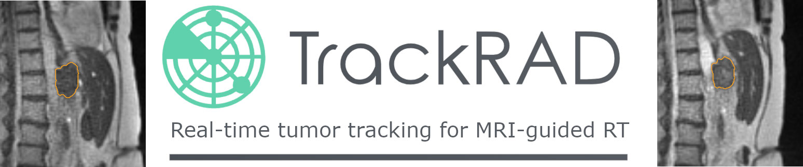

# TrackRAD2025

> This repository, the website and the possibility to participate is still under construction and will be released on February 15th, 2025.



## Contents

This repository contains:

- A **baseline algorithm** (`baseline-algorithm/`) to the trackRad challenge as a starting point.
- An example **datasets** (`dataset/`), following the format of the labeled trackrad dataset as well as a recommended folder structure for the trackrad datasets.
- The **evaluation** code (`evaluation/`) used for evaluating submissions, including a compact and fast custom implementation of the metrics.
- A [**testing-script**](test-algorithm.sh) (`test-algorithm.sh`) allowing for a local evaluation and testing.
- The content of the TrackRAD2025 website on [grand-challenge.org](trackrad2025.grand-challenge.org).
- A number of miscellaneous **scripts** (`scripts/`) and **images/assets** (`images/`)


## (Preliminary) Timeline

- Challenge website open: 15/12/2024
- Release training cases: 15/03/2025
- Start of challenge - Training phase: 15/03/2025 - 15/08/2025
- Preliminary testing phase (10 submissions per team): 01/06/2025 - 15/08/2025
- Advertisement of the challenge at ESTRO 2025: 04/05/2025
- Testing phase (2 submissions per team): 16/07/2023 - 15/08/2023
- Deadline for algorithm information form and LNCS format algorithm description: 01/09/2025
- Announcements and invitation to present: 09/09/2025
- Post-challenge phase: submission possible for a couple of years

## 🎯 Background

The use of magnetic resonance imaging (MRI) to visualize and characterize motion is becoming increasingly important in the treatment of cancer patients, especially in radiotherapy. For tumors affected by it, motion management is crucial to ensure a high radiation dose to the tumor while sparing neighboring organs. The recent development of MRI-guided radiotherapy with hybrid MRI-linear accelerator (linac) systems \[[Keall et al., 2022](https://www.nature.com/articles/s41571-022-00631-3)\], called MRI-linacs, offers the possibility to adapt to changes in tumor position during treatment. 2D cine-MRI (a time-resolved sequence of 2D images continuously acquired a the same location) allows real-time tumor motion visualization and closely following the tumor with the radiation beam, but requires automated tumor segmentation/tracking. This needs to be done in real-time, with high accuracy and robustness. Currently, clinically available solutions rely on conventional deformable image registration (DIR) or on template matching. These methods struggle with large non-rigid motion, limiting application to beam gating.

The fast inference of artificial intelligence (AI) methods, obtained by shifting computation time to the training phase, is promising for this task \[[Lombardo et al., 2024](https://www.thegreenjournal.com/article/S0167-8140(23)89864-4/abstract)\].

TrackRAD2025 aims to advance MRI-guided radiotherapy by providing cine-MRI data from multiple institutions to evaluate real-time tumor tracking methods on a unified platform.

## Dataset

TrackRAD2025 provides a public multi-institutional datasets of both unlabeled and labeled 2D cine-MRI frame sequences for development and testing. Six international centers (3 Dutch, 1 German, 1 Australian, and 1 Chinese) provided data from 0.35 T and 1.5 T MRI-linacs. A further (private) labeled dataset was collected for testing and evaluation.

The public datasets provided for the trackrad 2025 challenge can be found here:

- [Labeled Dataset](https://zenodo.org/records/14808346)
- Unlabeled dataset will be available by the begining of he challenge

The format is documented in the dataset paper

> To be published

and on the [Data page](https://trackrad2025.grand-challenge.org/data/) on grand-challenge.

To download the datasets and place them in the expected locations, you can run the following commands:


```sh
# Labeled dataset (about 3 GiB) for unsupervised learning or evaluation

wget TODO
#Unlabeled dataset (about X GiB) for unsupervised learning:

wget TODO
```

We recommend placing the dateset in the `dataset/` subfolder of this repository, following the following structure:

```sh
dataset/
├── example # a single example case for technical testing
│   └── Z_001
│       ├── b-field-strength.json
│       ├── frame-rate.json
│       ├── images
│       │   └── Z_001_frames.mha
│       ├── scanned-region.json
│       └── targets
│           ├── Z_001_first_label.mha
│           └── Z_001_labels.mha
├── labeled # labeled data for supervised training
├── unlabeled # unlabeled data for unsupervised training
├── preliminary # private - cases used for the first phase
└── testing # private - cases used for the final phase
```

## Getting started

Follow these steps (also availabel [here](https://trackrad2025.grand-challenge.org/task/) and [here](https://github.com/LMUK-RADONC-PHYS-RES/trackrad2025/blob/main/pages/Task.md)) to set up your development environment and prepare your submission.

#### 1. Clone the Official Repository
Begin by cloning the official [trackrad2025 repository](https://github.com/LMUK-RADONC-PHYS-RES/trackrad2025):

```bash
git clone git@github.com:LMUK-RADONC-PHYS-RES/trackrad2025.git
```

This repository includes:

- Challenge information
- Code used for evaluation and local testing
- A baseline algorithm to help you get started

#### 2. Download and Place the Dataset

Download the [dataset](https://trackrad2025.grand-challenge.org/data/) from Zenodo and place it in the dataset/ folder. Use the labeled dataset for supervised training and model evaluation. For unsupervised training you may want to use the unlabeled dataset, for supervised training and evaluation of your model the labeled dataset is sufficient.

 
> Tip: A synthetic sequence (formatted like the labeled data) is also provided in the repository to help you get started quickly, even while still downloading the dataset.

#### 3. Test the Baseline Algorithm
Before modifying anything, verify that the baseline and evaluation are working correctly:

```
sh test-algorithm.sh
```

This script will compile, execute, and test the baseline algorithm with the synthetic example scan. 

Familiarize yourself with the parameters at the top of the script (especially ALGORITHM_DIR and DATASET_DIR). You will need to update these paths when evaluating your own algorithm.

#### 4. Understand the baseline

Open `baseline-algorithm/model.py` in your code editor. You will see the following function:
 
```python
def run_algorithm(frames: np.ndarray, 
    target: np.ndarray, 
    frame_rate: float, 
    magnetic_field_strength: float, 
    scanned_region: str) -> np.ndarray:
    """
    Implement your algorithm here.

    Args:
    - frames (numpy.ndarray): A 3D numpy array of shape (W, H, T) containing the MRI linac series.
    - target (numpy.ndarray): A 2D numpy array of shape (W, H) containing the MRI linac target.
    - frame_rate (float): The frame rate of the MRI linac series.
    - magnetic_field_strength (float): The magnetic field strength of the MRI linac series.
    - scanned_region (str): The scanned region of the MRI linac series.
    """
    
    # frames.shape == (W, H, T)
    # target.shape == (W, H)

    # For the example we want to repeat the initial segmentation for every frame 
    repeated_target = np.repeat(target, frames.shape[2], axis=-1)

    # repeated_target.shape == (W, H, T)
    return repeated_target
```


#### 5. Start Developing Your Own Model

Copy the baseline algorithm folder to a new folder to work in.

```bash
cp -R baseline-algorithm your-algorithm
```

Navigate into your new folder and initialise it as a separate git repository:

```bash
cd your-algorithm
git init
```

Modify the test-algorithm.sh script in the main repository to point to your new folder (update the ALGORITHM_DIR path).

```bash
ALGORITHM_DIR="./your-algorithm"
```

> Tip: By this time your download of the labeled dataset could be done and you could also update the dataset path, to use the labeled dataset. If you don't just want to verify that your algorithm works on a technical level, that is. 
 
```bash
# This might also be a good time to 
DATASET_DIR="./dataset/labeled"
```

#### 6. Implement Your Model:

Edit the model.py file in your working copy to implement your algorithm. Make sure to keep the function signature of the run_algorithm function intact. This way you ensure that your submission is functional.

```python
def run_algorithm(frames: np.ndarray, # frames.shape == (W, H, T)
    target: np.ndarray, # target.shape == (W, H)
    frame_rate: float, 
    magnetic_field_strength: float, 
    scanned_region: str) -> np.ndarray:

    # Example: Repeat the initial segmentation 
    repeated_target = np.repeat(target, frames.shape[2], axis=-1)

    return repeated_target # repeated_target.shape == (W, H, T)
```

**Note:** When adding files or folders to it make sure to add them the the Dockerfile. This is required for the submission on grand-challenge, where you provide the platform access to github repository you created earlier. Alternatively, but not recommended, you can upload a container image, e.g. created using the save.sh script provided with the baseline algorithm. 
**However, we still require read access to your model source code for price eligibility.**

#### 7. Have Fun

Have fun developing and contributing the the future of cine-MRI target tracking!

P.S.: When you are ready to test your submission on grand-challenge or submit your final version, go to the [Submission Instructions](https://trackrad2025.grand-challenge.org/submission-instructions/).


## 📊 Evaluation

Submitted algorithms will be evaluated based on their ability to reproduce ground truth segmentation labels on the test set, using the following metrics:

- Dice similarity coefficient
- 95th percentile of the surface distance distribution
- Average surface distance
- Euclidian 2D center-of-mass distance
- Dosimetric accuracy under simulated MLC tracking
- Speed of inference/runtime

A detailed description of these metrics and the ranking process can be found [here](https://trackrad2025.grand-challenge.org/metrics/) or [here](pages/Metrics.md).

The metrics are implemented [here](evaluation/evaluate.py).
